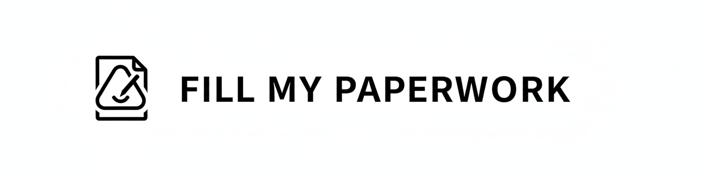
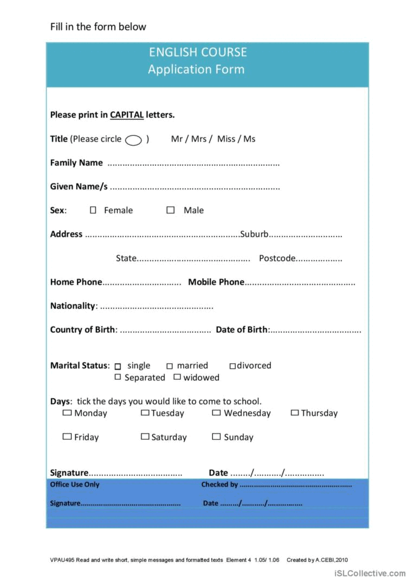

# Demo

Available at: <br>
[https://fill-my-papers-424605661533.europe-west9.run.app](https://fill-my-papers-424605661533.europe-west9.run.app)



<br>
<br>

## Run app locally
```bash
cd $WORKDIR
export GCP_PROJECT=$(gcloud config get-value project)  # or use a .env in the same dir
gcloud auth application-default login  # to use Gemini
uvicorn fastapi_server:app --host 0.0.0.0 --port 8080 --reload # open http://localhost:8080/
```
~~python3 -m http.server 8000~~ # frontend is served already by the backend

## Deploy on GCP
This deploys the `fastapi_server.py` and the  `index.html` frontend as a single Cloud Run service.
```bash
cd $WORKDIR
SERVICE=fill-my-papers
PROJECT=$(gcloud config get-value project) 
REGION=europe-west9
IMAGE=eu.gcr.io/$PROJECT/$SERVICE:latest
gcloud builds submit --project $PROJECT --tag $IMAGE . 
&& gcloud run deploy $SERVICE --project $PROJECT --region $REGION --image $IMAGE --platform managed --allow-unauthenticated --min-instances=0 --max-instances=2 --cpu=1 --memory=512Mi --port=8080 --timeout=360s 
```

## Requirements
- Vertex AI, Gemini, Cloud Run, Cloud Build, Artifact Registry

## Run tests locally
```bash
cd $WORKDIR
pytest -n auto -q # backend
npx playwright test --config playground/playwright.config.ts # frontend
```